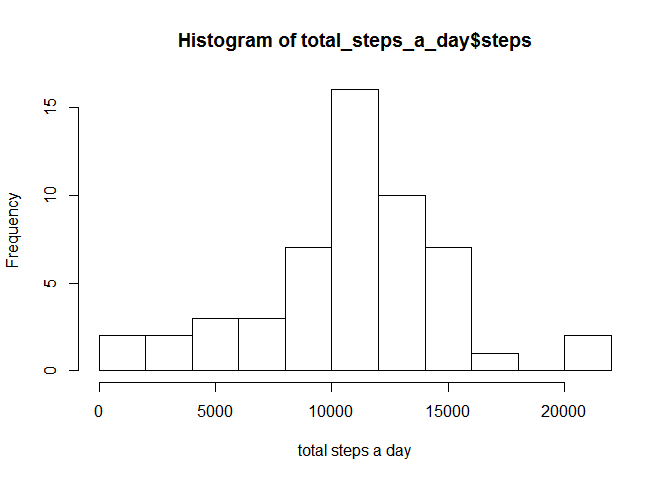

# Reproducible Research: Peer Assessment 1


## Loading and preprocessing the data

```r
data <- read.csv(unz("activity.zip","activity.csv"), head=TRUE)
```


## What is mean total number of steps taken per day?
1. Calculating the total number of steps taken per day

```r
total_steps_a_day <- aggregate(steps ~ date, data=data, sum, na.action=na.pass)
```

2. Histogram

```r
hist(total_steps_a_day$steps, breaks=10, xlab="total steps a day")
```



3. Mean and Median

```r
mn <- as.integer(mean(total_steps_a_day$steps, na.rm=T))
medim <- median(total_steps_a_day$steps, na.rm=T)
```
mean is 10766 and median is 10765


## What is the average daily activity pattern?
1. Time Series Plot over the interval (Average across all days)

```r
interval_avg_step <- aggregate(steps ~ interval, data=data, mean)
plot(interval_avg_step, type="l", ylab="average steps taken")
```


2.What's the interval that has maximum?

```r
max <- interval_avg_step$interval[which(interval_avg_step$steps==max(interval_avg_step$steps))]
```
Maximum interval = 835


## Imputing missing values
1. How many NA in the data?

```r
num_NA <- sum(is.na(data))
```
There are 2304 NAs in the data


2. Strategies for filling up those NA
Filling with Average of that interval

```r
data$imputed_step = data$steps

for(i in 1:nrow(data)){
    if(is.na(data$steps[i])) {
        data$imputed_step[i] <- mean(data$steps[which(data$interval==data$interval[i])], na.rm=T)
    }
}
```

3. Histogram, mean & median of imputed_step data

```r
total_steps_a_day1 <- aggregate(imputed_step ~ date, data=data, sum)
hist(total_steps_a_day1$imputed_step, breaks=10, xlab="total steps a day")
```


```r
me <- as.integer(mean(total_steps_a_day1$imputed_step))
med <- median(total_steps_a_day1$imputed_step)
```
From imputed data, mean is 10766 and median is 1.0766189\times 10^{4}


## Are there differences in activity patterns between weekdays and weekends?
1. Creating factor variable "weekday" and "weekend"

```r
data$day <- weekdays(as.Date(data$date))
data$wday <- NA
for(i in 1:nrow(data)){
    if(data$day[i]=="Saturday" | data$day[i]=="Sunday"){data$wday[i] <- "weekend"} else
        {data$wday[i] <- "weekday"}
}
```

2. Aggregate on interval and wday

```r
interval_avg_wday <- aggregate(imputed_step ~ interval + wday, data=data, mean)
interval_avg_wday$wday <- as.factor(interval_avg_wday$wday)
```

3. Panel plot (time-series over 5-min interval)

```r
library(ggplot2)
```

```
## Warning: package 'ggplot2' was built under R version 3.2.3
```

```r
ggplot(interval_avg_wday, aes(x=interval, y=imputed_step)) + geom_path() + facet_wrap(~wday, nrow=1)
```


